<h1 align="center">
  Vincular tu cuenta de github por ssh en la terminal
</h1>

## PASO 1

Verificar que la carperta .ssh este creada en tu usuario

``` sh
cd ~/
ls -la
```

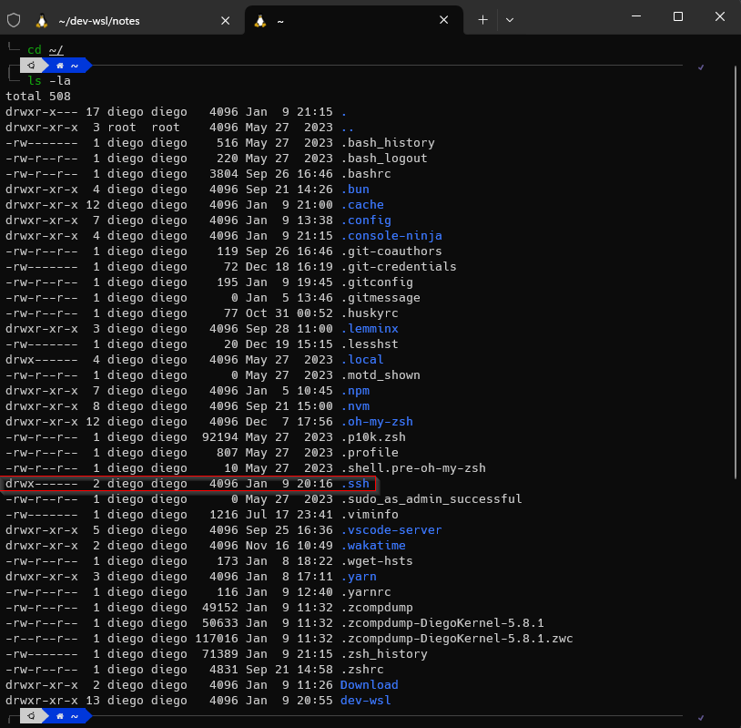

## PASO 2

Entrar a la carpeta .ssh y si no esta creada, crearla con:

``` sh
mkdir ~/.ssh
cd ~/.ssh
```

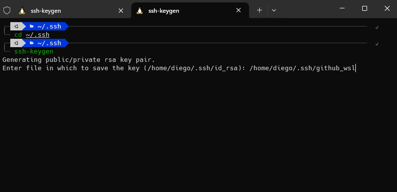

## PASO 3

Te va a pedir que le des el nombre y la ruta donde queres que se guarde, si lo queres cambiar copia la ruta que te aparece y modificala, en mi caso es /home/diego/.ssh/id_rsa y lo voy a ponerle el siguente nombre: /home/diego/.ssh/github-wsl y le voy a dar enter

``` sh
ssh-keygen
```

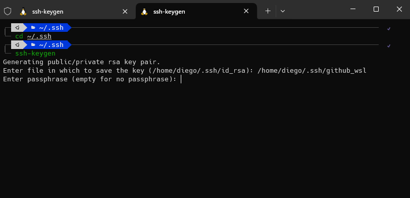


## PASO 4

Te va a pedir que ingreses la contraseña dos veces (tiene que ser la misma, y cuando escribas no se va a ver) Y le das Enter cuando escribas la contraseña

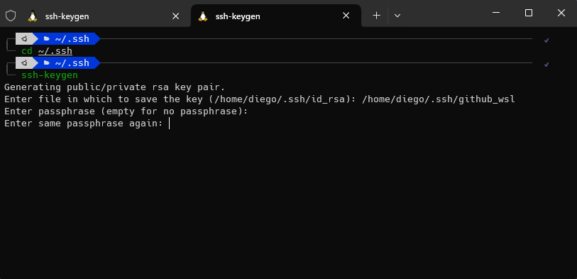

Si todo sale bien se tien que ver asi:

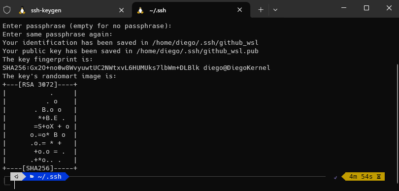

## PASO 5

Mostramos los archivos generados, en mi caso esos dos:

``` sh
ls
```

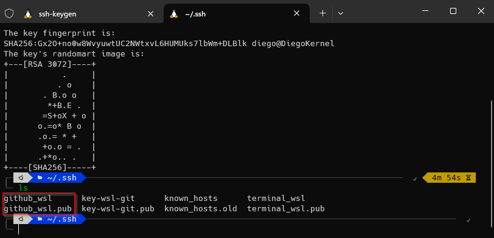

## PASO 6

Copiamos la clave ssh generada, para ver la clave y copiarla:

``` sh
cat github_wsl
```

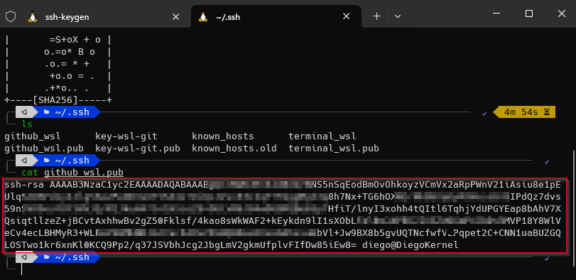

## PASO 7

Vamos a github, ajustes de la cuenta y creamos una nueva ssh key


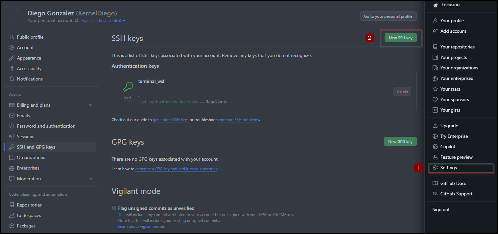

Una vez estememos dentro copiamos la clave ssh y le asignamos un nombre y guardamos con Add SSH Key

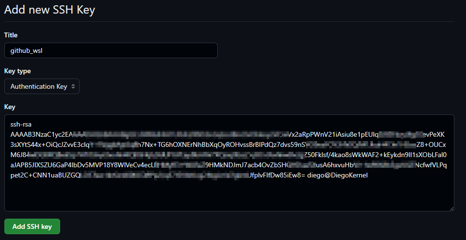

## PASO 8

Luego en Git Bash iniciamos un agente administrador de claves el cual nos sirve para mantener en cache nuestra clave utilizada en las diferentes sesiones a los servers.

``` sh
eval $(ssh-agent -s)
```


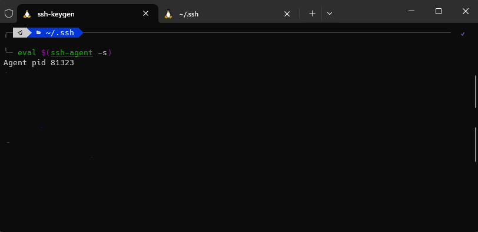


## PASO 9

Luego vinculamos nuestra clave privada con nuestro agente administrativo cabe destacar que la clave es la generada anteriormente para github_wsl en el PASO 3

``` sh
ssh-add ~/.ssh/github_wsl
```

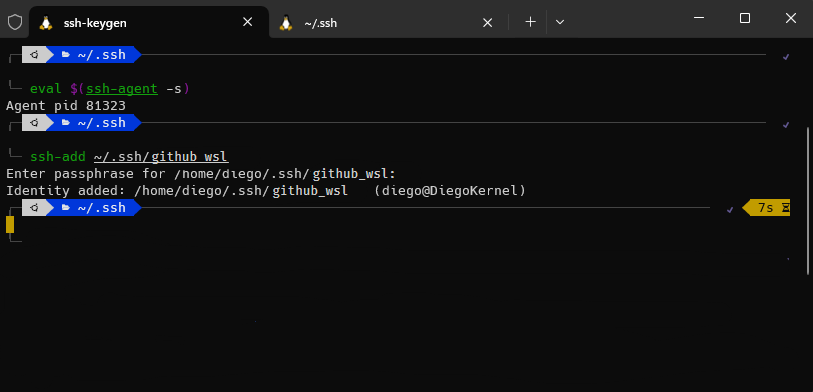

---

Con eso quedaria guardada tu clave ssh para cuando tengas que clonar repositorios con tu cuenta y esten privado